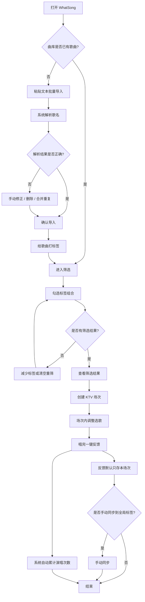
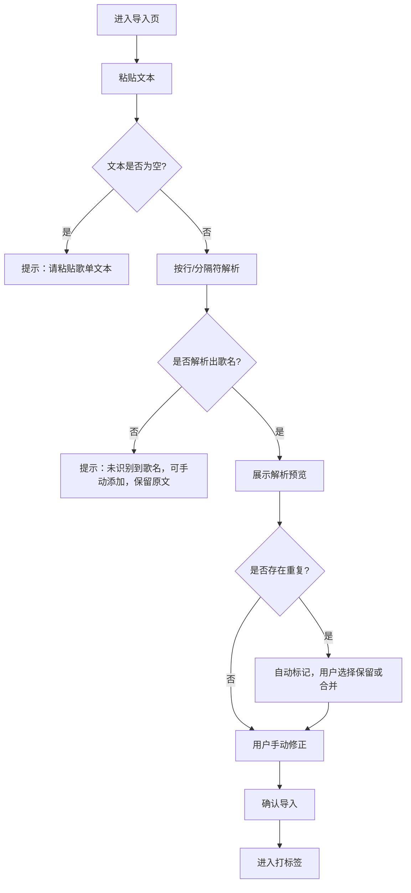
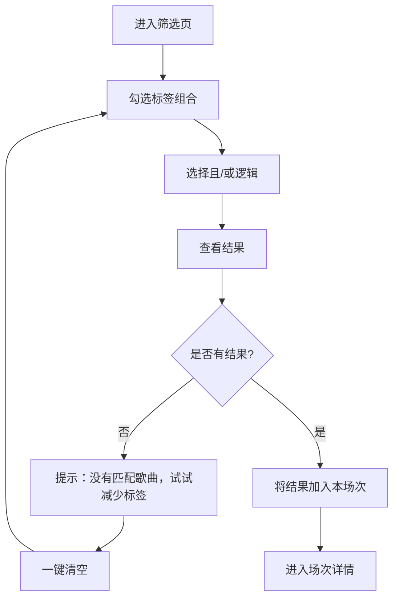
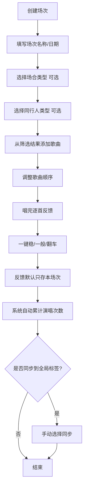

# WhatSong｜我颂——核心用户流程

## 一、主流程

## 二、导入流程

## 三、筛选流程

## 四、场次与反馈流程

## 五、关键规则说明

- 系统只自动累计每首歌的演唱次数，不自动计算熟练度。
- 系统不自动生成标签，不自动修改全局标签。
- 场次反馈默认只保存在本场次。
- 用户可手动选择是否将本场次反馈同步到全局标签。
- 筛选支持多标签组合，逻辑可切换“且/或”。
- 导入不联网搜索歌曲，仅解析用户粘贴的文本。
