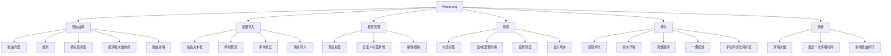
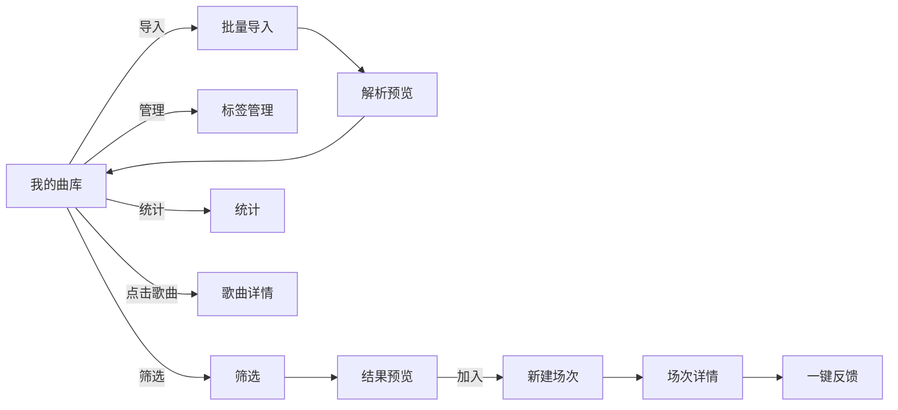

# WhatSong｜我颂——信息架构

## 一、产品结构总览

## 二、页面层级

### 一级页面

| 页面 | 作用 | 入口 |
|---|---|---|
| 我的曲库 | 查看全部歌曲 | 默认首页 |
| 批量导入 | 粘贴文本批量入库 | 曲库页按钮 |
| 标签管理 | 管理预设和自定义标签 | 曲库页入口 |
| 筛选 | 多标签组合筛选 | 曲库页入口 / 独立入口 |
| 场次 | 新建和管理 KTV 场次 | 曲库页入口 / 筛选结果 |
| 统计 | 查看演唱次数等数据 | 底部导航 |

### 二级页面

| 页面 | 所属 | 作用 |
|---|---|---|
| 歌曲详情 | 我的曲库 | 查看单首歌信息、标签、演唱次数 |
| 解析预览 | 批量导入 | 确认解析结果 |
| 新建场次 | 场次 | 填写场次信息 |
| 场次详情 | 场次 | 查看本场选歌、反馈 |
| 标签编辑 | 标签管理 | 新增/编辑/删除标签 |

## 三、导航结构

### 底部导航（建议 4 个 Tab）

| Tab | 图标建议 | 作用 |
|---|---|---|
| 曲库 | 音乐列表 | 全部歌曲 |
| 筛选 | 筛选漏斗 | 临场选歌 |
| 场次 | 场次卡片 | KTV 场次记录 |
| 统计 | 柱状图 | 演唱次数统计 |

### 次级入口

- 批量导入：放在曲库页右上角
- 标签管理：放在曲库页筛选栏旁
- 歌曲详情：点击歌曲进入

## 四、信息架构原则

1. **一级不超过 4 个**：避免底部导航拥挤
2. **核心动作不超过 3 步**：导入、筛选、反馈都要在 3 步内完成
3. **不做多层级分类**：避免知识库式搭建
4. **不做强制引导**：打开即用
5. **不做设置页堆砌**：设置项尽量少

## 五、页面关系图

